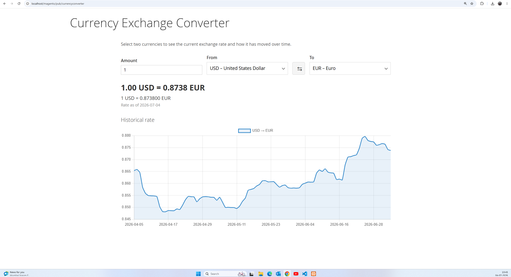
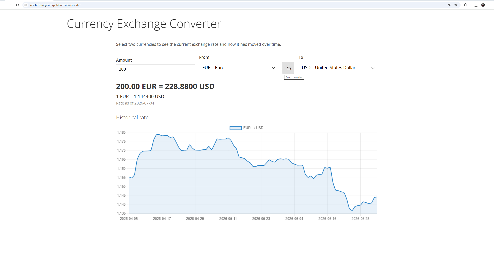

# magentoCurrencyConverter

A custom **Magento 2** module that adds a storefront **Currency Exchange Converter** page.
Buyers can pick any currency supported by [Frankfurter](https://frankfurter.dev) as the
**From** and **To** currency, see the current exchange rate, convert an amount, swap the two
currencies with one click, and view how the rate has moved over time on a historical line chart.

The module lives at [`app/code/Suhas/CurrencyConverter`](app/code/Suhas/CurrencyConverter).

---

## Screenshots





---

## Features

- **Storefront converter page** at `/currencyconverter`
- **Current exchange-rate lookup** for any supported pair (with live amount conversion)
- **Swap control** to flip the From/To currencies
- **Historical chart** (Chart.js) of the daily rate over a configurable window
- All Frankfurter calls happen **server-side** (no CORS issues; the upstream API URL is never
  exposed to the client beyond the module's own AJAX endpoints)
- **Currency list is cached** to avoid hammering the API

---

## Requirements

- Magento **2.4.x**
- PHP **8.1 / 8.2 / 8.3**
- Outbound HTTPS access to `https://api.frankfurter.dev` from the Magento server

---

## Installation

From your Magento root:

```bash
# 1. The module is already in place at app/code/Suhas/CurrencyConverter

# 2. Enable and install
bin/magento module:enable Suhas_CurrencyConverter
bin/magento setup:upgrade

# 3. Compile DI + deploy static content (production mode)
bin/magento setup:di:compile
bin/magento setup:static-content:deploy

# 4. Flush caches
bin/magento cache:flush
```

In **developer mode** you can skip `setup:di:compile` / `setup:static-content:deploy`.

Then open:

```
https://<your-store>/currencyconverter
```

---

## Configuration

Settings are fixed constants in `Model/Config.php` (no admin UI, to keep the module small):

| Constant | Default | Description |
| --- | --- | --- |
| `API_BASE_URL` | `https://api.frankfurter.dev/v2` | v2 API base (no trailing slash). |
| `DEFAULT_FROM` | `USD` | ISO 4217 code pre-selected on load. |
| `DEFAULT_TO` | `EUR` | ISO 4217 code pre-selected on load. |
| `HISTORY_DAYS` | `90` | Days of history the chart shows. |
| `CACHE_LIFETIME` | `3600` | How long (seconds) the currency list is cached. |

---

## Architecture

```
Controller\Index\Index          Renders the page (1column layout).
Block\Converter                 Supplies endpoint URLs + defaults to the template as JSON.
view/frontend/.../converter.phtml   Markup + data-mage-init bootstrap.
view/frontend/web/js/converter.js   Widget: populate selects, fetch rate/history, swap, chart.

Controller\Ajax\Currencies      GET currencyconverter/ajax/currencies
Controller\Ajax\Rate            GET currencyconverter/ajax/rate?from=&to=
Controller\Ajax\History         GET currencyconverter/ajax/history?from=&to=&days=
        │  (all extend Controller\Ajax\AbstractAjax — shared JSON envelope + error handling)
        ▼
Api\ExchangeRateServiceInterface  ← DI preference →  Model\ExchangeRateService
        │  (validation, caching, HTTP transport, payload normalisation)
        ▼
   Frankfurter v2 API

Model\Config                    Fixed settings (API URL, defaults, history window, cache TTL).
Exception\ApiException          Carries an HTTP status: 400 (bad input) or 502 (upstream).
```

### Frankfurter endpoints used

| Purpose | Frankfurter call |
| --- | --- |
| Currency list | `GET /v2/currencies` |
| Current rate | `GET /v2/rate/{base}/{quote}` |
| Historical series | `GET /v2/rates?from={date}&to={date}&base={base}&quotes={quote}` |

### Design decisions

- **Server-side proxy.** The browser talks only to the module's own controllers; the module
  talks to Frankfurter. This avoids CORS problems and keeps the integration swappable (change
  `Config::API_BASE_URL`, or the service, without touching JS).
- **Service behind an interface.** `ExchangeRateService` (bound via `di.xml`) owns HTTP
  transport, input validation, caching, and payload normalisation, so the controllers stay
  trivial and the implementation can be swapped without changing callers.
- **`same-currency` short-circuit.** The rate is trivially `1.0`, so the service returns a `1.0`
  rate (and a flat series) without a remote call.
- **Chart.js reuses Magento's bundled library.** Magento ships Chart.js (aliased `chartJs` in
  `Magento_Ui`'s RequireJS config), so the widget depends on `chartJs` directly — no CDN and no
  custom `requirejs-config.js`, avoiding a mapping conflict with the bundled copy.
- **Request token in JS.** Rapid From/To switching can leave stale in-flight responses; a
  monotonic token ensures only the latest response renders.
- **Fixed configuration.** API URL, defaults, history window, and cache lifetime live as
  constants in `Model/Config.php` — one place to change, no admin UI to keep the module lean.

---

## Manual test checklist

1. Visit `/currencyconverter` — both selects populate; USD→EUR loads by default.
2. Rate line and converted amount appear; typing an amount updates the conversion live.
3. Change either currency — rate and chart refresh.
4. Click the swap control — From/To flip and values refresh.
5. Pick the same currency for both — rate shows `1.0`, chart is flat.
6. Request an invalid pair (e.g. `/currencyconverter/ajax/rate?from=XX&to=EUR`) — the endpoint
   returns a friendly `success:false` message with HTTP 400 rather than crashing.

---

## Uninstall

```bash
bin/magento module:disable Suhas_CurrencyConverter
bin/magento setup:upgrade
bin/magento cache:flush
```

To remove the code, delete `app/code/Suhas/CurrencyConverter`.

---

## Notes

- The vendor namespace `Suhas` is used as an interview-friendly convention. To rebrand, rename
  the `Suhas` directory, update the `Suhas\CurrencyConverter` PSR-4 namespace in `composer.json`
  and every PHP file, and the `Suhas_CurrencyConverter` references in XML.
- Frankfurter data is sourced from the European Central Bank and updated on working days around
  16:00 CET; weekends/holidays reuse the last working day's rate.
